# Biology at College of the Redwoods (Del Norte, CA)

This is a private repository for Biology courses at College of the Redwoods (Del Norte, CA), organized by Dr. Daniel Ari Friedman ([@docxology](https://github.com/docxology) on GitHub).

## Courses

This repository contains materials for two courses in Spring 2026:

- **[BIOL-1](biol-1/)**: Biology 1 at Pelican Bay Prison
- **[BIOL-8](biol-8/)**: Biology 8 at College of the Redwoods, Del Norte campus

## Repository Structure

```mermaid
graph TD
    Root[cr-bio/] --> Biol1[biol-1/]
    Root --> Biol8[biol-8/]
    Root --> Software[software/]
    Root --> Docs[Documentation Files]
    
    Biol1 --> Biol1Course[course/]
    Biol1 --> Biol1Private[private/]
    Biol1 --> Biol1Resources[resources/]
    
    Biol1Course --> Biol1Modules[module-1/, module-2/, ...]
    Biol1Modules --> Biol1Assignments[assignments/]
    Biol1Modules --> Biol1Materials[Lecture Slides, Lab Protocols, Study Guides, Quizzes]
    
    Biol1Private --> Biol1Tests[Tests and Answers]
    Biol1Private --> Biol1Access[Accessibility Accommodations]
    
    Biol1Resources --> Biol1Ref[Reference Materials]
    Biol1Resources --> Biol1Media[Media Resources]
    Biol1Resources --> Biol1Links[External Links]
    Biol1Resources --> Biol1Templates[Templates]
    
    Biol8 --> Biol8Course[course/]
    Biol8 --> Biol8Private[private/]
    Biol8 --> Biol8Resources[resources/]
    
    Biol8Course --> Biol8Modules[module-1/, module-2/, ...]
    Biol8Modules --> Biol8Assignments[assignments/]
    Biol8Modules --> Biol8Materials[Lecture Slides, Lab Protocols, Study Guides, Quizzes]
    
    Biol8Private --> Biol8Tests[Tests and Answers]
    Biol8Private --> Biol8Access[Accessibility Accommodations]
    
    Biol8Resources --> Biol8Ref[Reference Materials]
    Biol8Resources --> Biol8Media[Media Resources]
    Biol8Resources --> Biol8Links[External Links]
    Biol8Resources --> Biol8Templates[Templates]
    
    Software --> SoftwareSrc[src/]
    Software --> SoftwareTests[tests/]
    Software --> SoftwareDocs[docs/]
    
    style Root fill:#e1f5ff
    style Biol1 fill:#fff4e1
    style Biol8 fill:#fff4e1
    style Software fill:#e8f5e9
```

## Course Folder Structure

Each course folder (`biol-1/` and `biol-8/`) contains:

### `course/` Directory
Public course materials organized by modules. Each module folder contains:
- **`assignments/`**: Assignment files for the module
- **Lecture Slides**: Presentation materials
- **Lab Protocols and Notes**: Laboratory instructions and documentation
- **Study Guides**: Student study materials
- **Quizzes**: Assessment materials
- **Other Materials**: Additional course resources

Module folders are uploaded to the course Canvas site.

### `private/` Directory
Private instructor materials not shared with students:
- **Tests and Answers**: Assessment materials with answer keys
- **Accessibility Accommodations**: Student accommodation documentation
- **Other Materials**: Additional private resources

### `resources/` Directory
Supplementary resources that support course instruction and student learning:
- **Reference Materials**: Textbooks, scientific papers, and reference documents
- **Media Resources**: Videos, animations, interactive content, and multimedia resources
- **External Links**: Curated links to external websites, databases, and educational resources
- **Templates**: Document templates, formatting guides, and reusable materials

## Software Utilities

The [`software/`](software/) folder contains executable code for course management, including:
- **`src/`**: Source code for utilities
- **`scripts/`**: Generation scripts for processing course materials
- **`tests/`**: Test files
- **`docs/`**: Software documentation

Utilities include modules for:
- Markdown to PDF rendering
- Text-to-speech generation (MP3 audio)
- Format conversion (DOCX, HTML, TXT)
- HTML website generation with interactive quizzes
- Batch processing for entire modules
- Syllabus processing

### Generation Scripts

Comprehensive scripts are available in [`software/scripts/`](software/scripts/) to generate all course material outputs:

- **`generate_all_outputs.py`**: Process all modules and syllabi for both courses
- **`generate_module_renderings.py`**: Process a specific module
- **`generate_module_website.py`**: Generate HTML website for a module
- **`generate_syllabus_renderings.py`**: Process syllabus files

See [`software/scripts/README.md`](software/scripts/README.md) for detailed usage instructions.

## Documentation

- **[AGENTS.md](AGENTS.md)**: Technical documentation for repository structure, conventions, and automation processes
- Course-specific documentation is available in each course folder's README.md and AGENTS.md files
