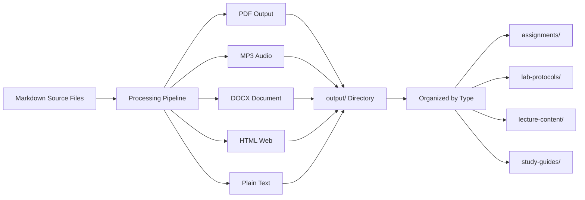

# BIOL-8 Course Materials

## Overview

This directory contains all public course materials for BIOL-8 (Biology 8 at College of the Redwoods, Del Norte Campus, Spring 2026), organized by module. All materials in this directory are suitable for upload to Canvas and distribution to students.

## Course Structure

The course is organized into modules, each containing assignments, lecture materials, lab protocols, and study guides.

### Modules

- [Module 1](module-1/) - Course modules as they are developed
- [Module 2](module-2/) - Additional modules
- [Module 3](module-3/) - Additional modules as they are added

## File Organization

### Curriculum Element Types

Course materials are organized by curriculum element type:

1. **Assignments** (`assignments/` directory)
   - Located in each module's `assignments/` subdirectory
   - Markdown files with assignment instructions
   - Processed to PDF, MP3, DOCX, HTML, and TXT formats

2. **Lab Protocols** (`sample_lab-protocol.md`)
   - Laboratory instructions and procedures
   - Markdown format for easy editing
   - Processed to all export formats

3. **Lecture Content** (`sample_lecture-content.md`)
   - Lecture materials and presentation content
   - Markdown format
   - Processed to all export formats

4. **Study Guides** (`sample_study-guide.md`)
   - Student study materials and review guides
   - Markdown format
   - Processed to all export formats

### File Processing Workflow

All markdown files in module directories are processed through an automated pipeline that generates multiple output formats:



### Output Organization

Processed files are organized in the `output/` directory within each module:

```
module-X/output/
├── assignments/
│   ├── [file].pdf
│   ├── [file].mp3
│   ├── [file].docx
│   ├── [file].html
│   └── [file].txt
├── lab-protocols/
│   └── [same format structure]
├── lecture-content/
│   └── [same format structure]
├── study-guides/
│   └── [same format structure]
└── website/
    └── index.html
```

## File Naming Conventions

### Source Files

- **Assignments**: `module-[N]-assignment-[number]-[description].md`
  - Example: `module-1-assignment-1-introduction.md`
- **Lab Protocols**: `sample_lab-protocol.md` (or `module-[N]-lab-[number]-[topic].md`)
- **Lecture Content**: `sample_lecture-content.md` (or `module-[N]-lecture-[topic].md`)
- **Study Guides**: `sample_study-guide.md` (or `module-[N]-study-guide.md`)

### Output Files

Output files maintain the base filename with format-specific extensions:
- PDF: `[basename].pdf`
- Audio: `[basename].mp3`
- Document: `[basename].docx`
- Web: `[basename].html`
- Text: `[basename].txt`

## Processing

### Automated Processing

Module materials are processed using the batch processing utilities in the `software/` directory:

- **Script**: `software/scripts/generate_module_renderings.py`
- **Function**: `process_module_by_type()` from `batch_processing` module
- **Outputs**: All files processed to PDF, MP3, DOCX, HTML, and TXT formats

### Processing Pipeline

1. **Source Detection**: Markdown files are identified in module directories
2. **Type Classification**: Files are classified by curriculum element type (assignment, lab-protocol, lecture-content, study-guide)
3. **Format Generation**: Each file is processed to generate:
   - PDF via `markdown_to_pdf` module
   - MP3 via `text_to_speech` module
   - DOCX via `format_conversion` module
   - HTML via `format_conversion` module
   - TXT via text extraction from markdown
4. **Output Organization**: Generated files are organized by type in the `output/` directory
5. **Website Generation**: HTML websites are generated with all module content, audio, and interactive quizzes

## Canvas Upload

All materials in this directory are suitable for Canvas upload:

1. Verify all required files are present
2. Check that output formats have been generated
3. Upload module folders maintaining directory structure
4. Update Canvas links after upload

## Documentation

- **[AGENTS.md](AGENTS.md)**: Technical documentation for course-level file processing and workflows
- Module-specific documentation available in each module's `README.md` and `AGENTS.md`
